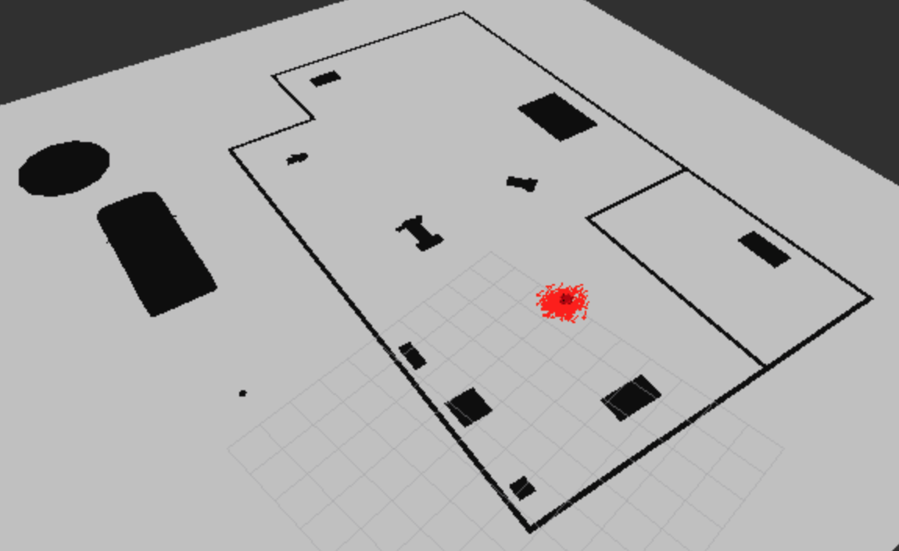
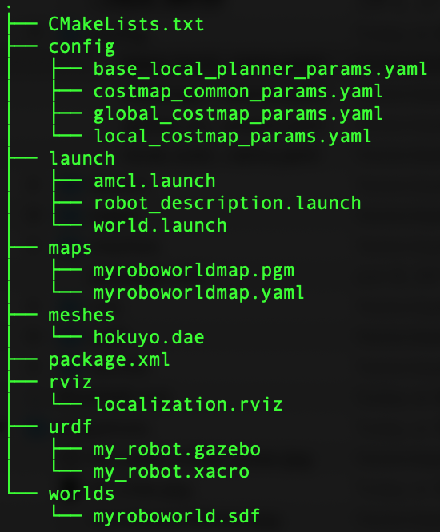
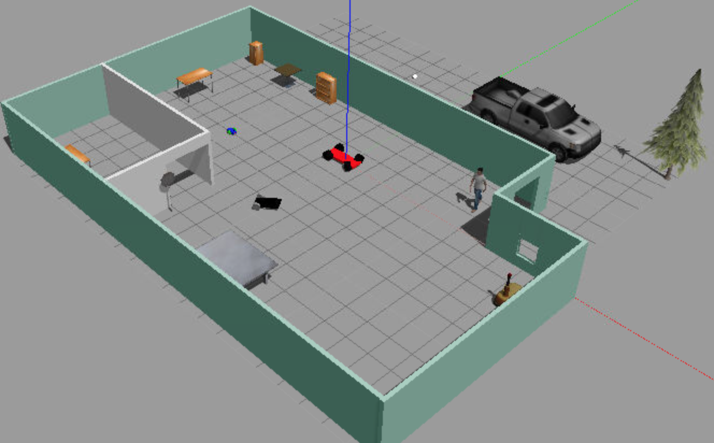
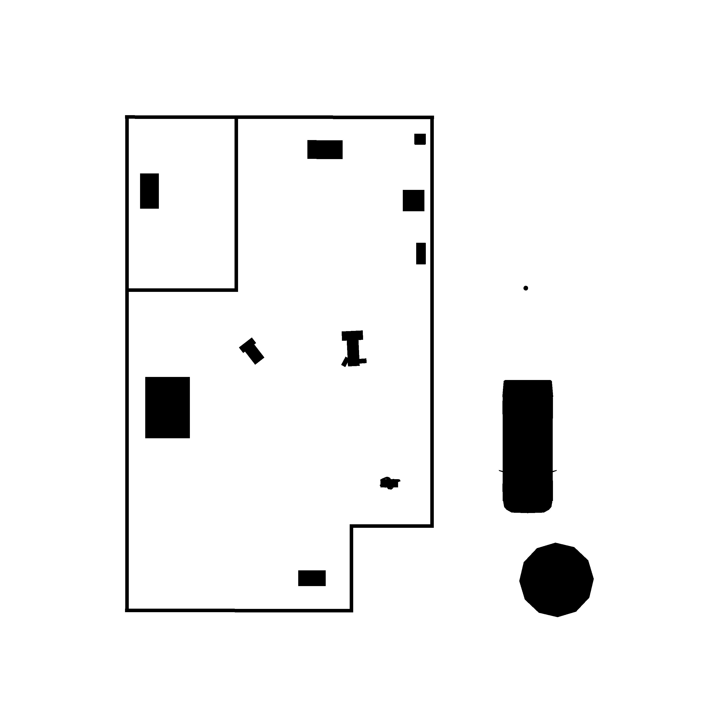
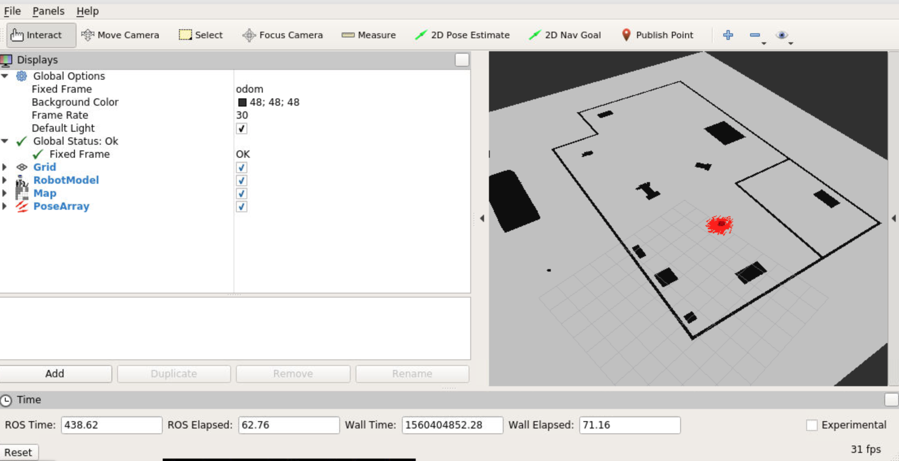
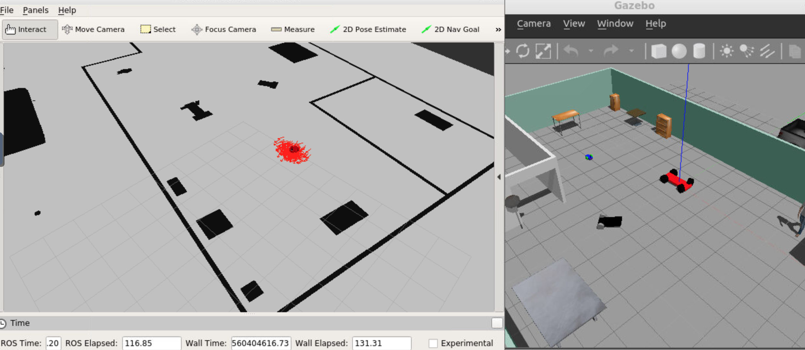

# Robot localization using AMCL localization package within ROS

Project-4 of Udacity's Robotics Software Engineer Nanodegree Program




**Project Goals**

In this project, the goal was to implement Adaptive Monte Carlo Localization (AMCL) package based robot localization within ROS framework. The project covers following topics:

* Create a ROS package that launches a custom robot model in a custom Gazebo world
* Utilize the ROS AMCL package and the Tele-Operation / Navigation Stack to localize the robot
* Explore, add, and tune specific parameters corresponding to each package to achieve the best possible localization results

### Prerequisites
(since I have not tested on multiple platforms, and versions, I am listing only the configuration I used)

* Ubuntu 16.04 OS with default make (>=4.1) and g++/gcc (>=5.4) packages
* Gazebo >= 7.0
* ROS Kinetic

### Directory Tree and contents

This directory represents the main project's `src` folder structure with following contents

* **`my_robot`** - my_robot package (tree structure is shown in image below)
	* `config` - folder with files defining parameters for AMCL package
	* `launch` - folder for launch files
	* `maps` - previously created maps using ROS package [pgm-map-creator](https://github.com/udacity/pgm_map_creator)
	* `meshes` - meshes folder for sensors
	* `rviz` - folder with rviz configuration files
	* `urdf` - folder for xacro files
	* `worlds` - folder for gazebo world files
	* `CMakeLists.txt` - compiler instructions
	* `package.xml` - package info
* README.md: this file.
* **snapshots**: folder with images/videos used for this *README.md* file

---

---

### Clone and Build

Since the folder presented here comprises only of ROS package, one needs to first create a catkin workspace and initialize it. Within your `home` directory, execute the following:

```
$ mkdir -p catkin_ws/src
$ cd catkin_ws/src
$ catkin_init_workspace
```

Within `~/catkin_ws/src/` download or clone folders of this repository:

```
$ cd ~/catkin_ws/src/
$ git clone https://github.com/viks8dm/Localization_Where-Am-I.git
```

Go back to catkin workspace and build it

```
$ cd ~/catkin_ws/
$ catkin_make
```

If one desires to use their own robot and world; one will have to modify the SDF file under `worlds` folder with appropriate SDF or `gazebo-world` file and replace the map within `maps` folder with their map which can be creted using pgm-map-creator package mentioned above once the gazebo-world has been set up. For example, for the gazebo-world used in this package the world and map snapshots are shown below (map is tilted w.r.t. the world snapshot or vice-cersa -:) ).





### Launch and visualization

AMCL package launch has been integrated within `world.launch` file, so only one launch command is needed. To start, source and launch the as follows:

```
$ source devel/setup.bash
$ roslaunch my_robot world.launch
```

This will launch RViz and Gazebo, showing an interface similar to that in image at top. The RViz configuration has been previously saved and added to launch file, so it will automatically display `pose-array` arrows in red around the robot.

---

---

---

To navigate the robot and observe its performance for already tuned parameters, one can send `2D Nav Goal` from RViz. Click the `2D Nav Goal` button in the toolbar, then click and drag on the map to send the goal to the robot. It will start moving and localize itself in the process. A demo is shown in the video here:

<video width="320" height="240" controls>
  <source src="./snapshots/video.mp4" type="video/mp4">
</video>

--- 
### Useful Resources

* AMCL package: [http://wiki.ros.org/amcl](http://wiki.ros.org/amcl)
* pgm-map-creator: [https://github.com/udacity/pgm_map_creator](https://github.com/udacity/pgm_map_creator)
